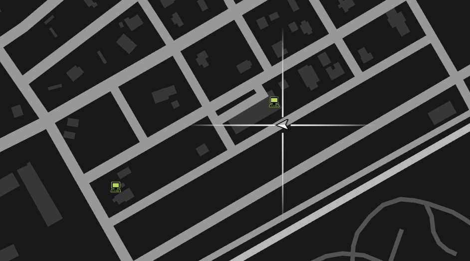
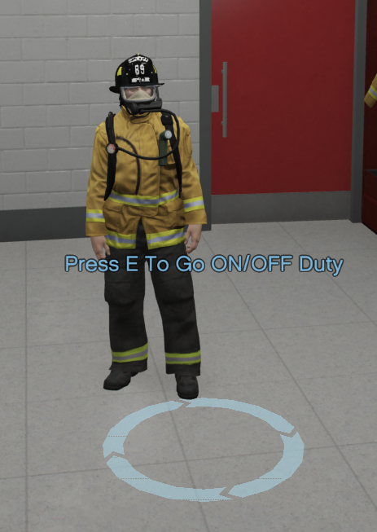
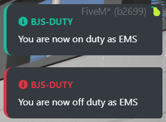

## B.John Studios Advanced 911 Script ##

`INFO and commands` 
This is a Advanced FiveM 911 script that allows for leo / dispatch to go on duty and receive 911 calls and caller proximity, which is ace perm restircted

- `To go On or Off Duty you will need to go to either the LEO or EMS / FIRE Blips on your in game map which will let you go on on or off duty.`


- /911 [message]                    `Will send a 911 call to the leo with the message provided, location and caller name.`   

    ### If there is no LEO on the server no one can send a 911 call in

    ### If there is a  Dispatcher on then the dispatcher will receive the 911 call only

    ### If there is no Dispatch on then all LEO OnDuty will receive the 911 call


## [Installation] ##

### Add These to you server.cfg these need to be in for the script to work ###

```
ensure BJS-911-Advanced

add_ace group.leo group.bjsleo allow
add_ace group.leo command.bjsleo allow
```

#### You will need to adujst the config file to the required vector3 coordinates that your server uses.


##  [Config] ##
```elixir
Config = {
    server_name = 'Enter Server Name', -- Change this to your server name if your wanting to
    prefix911 = "^4[911] ^3",
    prefixduty = "^4[BJS-Duty] ^3",
    blip_remove_time = 180000, -- This is the time in millerseconds that is will take for the 911 blip to go away
    perms = false,    -- Change this to true if your using in game ace_perms
    script_name = 'BJS-911-Advanced',

    -- Adjust Coordinates as needed
    
    PD_Locations = {
        vector3(1859.106, 3693.682, 34.267), -- Sandy Shores
        vector3(1690.548, 4855.421, 42.296),  -- Grapeseed
        vector3(-439.000, 6011.489, 36.996),  -- Paleto Bay
        vector3(-3058.196, 632.981, 7.493),  -- Cumash 
        vector3(-1620.437, -1020.492, 13.162),  -- Delperro 1
        vector3(-1084.548, -828.643, 15.646), -- Delperro 2
        vector3(-568.455, -114.797, 33.877), -- Rockford
        vector3(602.208, -4.712, 87.817), -- Vinewood 
        vector3(462.699, -996.549, 30.690), -- Mission Row 
        vector3(368.562, -1602.715, 29.292), -- Davis PD
        vector3(1539.147, 810.714, 77.656) -- Highway
    },
    EMS_Locations = {
        vector3(-367.835, 6104.745, 31.404), -- Paleto
        vector3(1680.963, 3598.000, 35.595), -- Sandy
        vector3(1214.859, -1475.029, 35.074), -- Elrancho FD
        vector3(206.640, -1652.395, 34.200), -- Davis
        vector3(-1220.262, -1411.605, 8.339) -- Delperro
    }
}
```

## Images



 

## Postal Resources by BlockBa5her
Postals Link - https://forum.cfx.re/t/release-nearest-postal-script/293511

## If you have any issues or inquires please join our discord bellow and create a ticket

https://discord.gg/nV9XPh9
